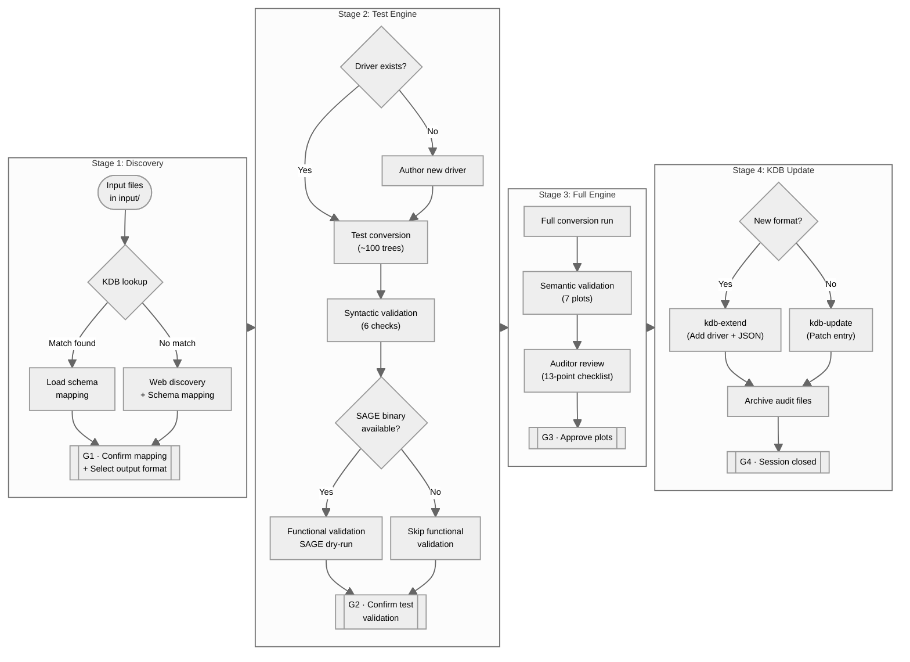

# SAGE Universal Merger Tree Converter

A toolkit for converting N-body simulation merger trees from various formats into SAGE-compatible LHaloTree files. It operates in two modes: **agent workflow** (LLM-orchestrated, for new or unknown formats) and **direct conversion** (script-based, for pre-registered formats).

## Overview

The converter translates merger tree outputs from common halo finders and tree-building codes into the SAGE LHaloTree format (HDF5 or binary). A built-in Knowledge Database (KDB) caches schema mappings for known formats so that previously converted formats require no re-mapping.

## Modes of Operation

| | Agent workflow | Direct conversion |
|---|---|---|
| Entry point | `claude` / `gemini` CLI | `runner/batch_runner.py` or `conversion-engine/main_driver.py` |
| Requires LLM CLI | Yes | No |
| Handles unknown formats | Yes | No — registered formats only |
| Validation pipeline | Automatic (syntactic + functional + semantic) | Manual (invoke scripts explicitly) |
| Multiple jobs per session | No | Yes (TOML batch config) |
| Parallel jobs | No | Yes (`--workers N`) |
| KDB registration | Yes (Stage 4) | No |
| Human-in-the-loop gates | Yes (G1–G4) | No |

**Agent workflow** is for formats that are new or unknown to the KDB. The LLM CLI (Claude Code or Gemini CLI) orchestrates a four-stage, human-in-the-loop gated pipeline: it discovers the format schema, maps fields, authors a new driver if needed, validates the output (syntactic + functional + semantic), and registers the result in the KDB. One conversion per session; validation gates cannot be skipped.

**Direct conversion** is for formats that already have a registered driver. You invoke the conversion engine directly (single job via `main_driver.py`, or one or many jobs via the TOML batch runner). Validation scripts exist but must be invoked manually. Parallel execution is supported.

## Supported Formats

### Input

| Halo Finder | Tree Tool | File Format |
| --- | --- | --- |
| AHF | MergerTree | ASCII |
| Rockstar | Consistent Trees | ASCII |
| FOF + Subfind (Gadget-2) | LHaloTree | HDF5 |
| FOF + Subfind (Gadget-4) | built-in | Binary / HDF5 |

### Output

| Format ID | Description |
| --- | --- |
| `lhalo_hdf5` | SAGE LHaloTree HDF5 (`TreeType=1`) — default |
| `lhalo_binary` | SAGE LHaloTree flat binary (`TreeType=0`, 104 bytes/halo) |

## Workflow (Agent Workflow)



### **Gate legend**

- `G1`: Schema confirmed
- `G2`: Test conversion validated
- `G3`: Semantic plots approved
- `G4`: KDB updated and session closed.

## Quick Start

### Prerequisites

- Docker (recommended) **or** Apptainer (for HPC) **or** Python 3.11+ with packages from `requirements.txt`
- Claude Code CLI or Gemini CLI (agent workflow only)
- An Anthropic or Gemini API key, or web login to the respective account.

### Setup

```bash
# 1. Copy environment template
cp .env.example .env

# 2. Fill in your API key and optional paths
#    ANTHROPIC_API_KEY=...
#    SAGE_BINARY_PATH=...   # optional: enables Stage 2 functional validation
#    PYTHON_BIN=...         # optional: override if running outside containers

# 3. Place your merger tree files in a named subdirectory of input/:
#      input/<dataset_name>/   (e.g. input/gadget4-dust/ or input/bolshoi/)
#    Files placed directly in input/ (not in a subdirectory) are not supported.
```

### Run — Agent Workflow

```bash
# Docker (recommended) — run from the project root
docker compose -f container/docker-compose.yml up

# Apptainer (HPC) — all commands run from the project root
# 1) Build image (choose your own output path/name for the .sif file)
module load apptainer
# Use --fakeroot if your cluster requires it for package installation at build time.
apptainer build sage-tree-converter.sif container/apptainer.def

# 2) Load Docker-equivalent bind and env configuration
source container/apptainer.env.sh

# 3) Start an interactive shell
apptainer shell --pwd /app sage-tree-converter.sif

# then, inside the container shell:
# claude   # or: gemini

# Native shell (Claude Code)
claude
```

Notes:

- All container commands are run from the **project root**, not from inside `container/`.
- Apptainer implicitly binds `$PWD` by default, but this can vary by launch directory; `container/apptainer.env.sh` forces deterministic bind paths.
- `container/apptainer.env.sh` sets deterministic bind mounts and container environment values so your run command stays short.
- For best filesystem performance in batch jobs, consider copying the `.sif` to local job temporary storage before running.

Apptainer self-check (optional):

```bash
# Run after: source container/apptainer.env.sh
apptainer exec --pwd /app sage-tree-converter.sif bash -lc '
    echo "[paths]";
    pwd;
    ls -ld /app /app/input /app/output;
    echo "[env]";
    env | rg "^(HOME|MPLCONFIGDIR|PYTHON_BIN|SAGE_BINARY_PATH|SAGE_MEMORY_MULTIPLIER|ANTHROPIC_API_KEY|GEMINI_API_KEY)="
'
```

Expected result:

- `/app`, `/app/input`, and `/app/output` are present.
- `HOME=/tmp` and `MPLCONFIGDIR=/tmp/matplotlib` are set.
- `PYTHON_BIN` and `SAGE_MEMORY_MULTIPLIER` reflect your `.env` values (or defaults).

In agent workflow mode, the LLM CLI guides you through all four stages interactively, presenting each gate prompt before advancing.

For running conversions directly without an LLM session, see [Direct Conversion](#direct-conversion).

## Direct Conversion

Direct conversion is for **registered formats only** (formats already in the KDB with an existing driver). It does not run the four-stage agent workflow; there are no discovery, mapping, or validation gates.

### Batch runner

The batch runner lets you drive one or more conversions from a single TOML config file. Jobs run in order by default; use `--workers N` for parallel execution.

```bash
# Run all jobs declared in the config
$PYTHON_BIN runner/batch_runner.py runner/conversion_config.toml

# Run only one named job from the config
$PYTHON_BIN runner/batch_runner.py runner/conversion_config.toml --job my_dataset

# After `pip install -e .` from the repo checkout, the entry point is also available:
# (editable install only,  non-editable `pip install .` is not supported)
sage-convert runner/conversion_config.toml
```

Edit `runner/conversion_config.toml` to declare your jobs. Each `[job.<name>]` section maps to one conversion run:

| Key | Required | Default | Notes |
| --- | --- | --- | --- |
| `format_id` | yes | — | Must be a registered format ID (see table in [Direct Conversion — Script Reference](#direct-conversion--script-reference)) |
| `input` | yes | — | Path to the input file or directory |
| `output` | yes | — | Path for the converted output file |
| `output_format` | no | `"lhalo_hdf5"` | `"lhalo_hdf5"` or `"lhalo_binary"` |
| `n_trees` | no | `null` | Convert only the first N trees (test mode) |
| `[job.<name>.sim_params]` | no | `{}` | Simulation parameter overrides (same keys as `--sim-config` JSON) |

A `[global]` section sets defaults inherited by all jobs. Individual jobs override global values by declaring the same key.

## Direct Conversion — Script Reference

If you already have a schema mapping and a driver, you can run the converter and its validation scripts directly without an LLM session.

All commands must be run from the **project root**. Replace `$PYTHON_BIN` with the value set in `.env`, or `python3` if unset.

### Registered format IDs

| Format ID | Halo finder / Tree tool | File type |
| --- | --- | --- |
| `ahf_mergetree_ascii` | AHF / MergerTree | ASCII |
| `rockstar_consistent_trees_ascii` | Rockstar / Consistent Trees | ASCII |
| `subfind_lhalotree_binary` | FOF + Subfind (Gadget-2) / LHaloTree | Binary |
| `subfind_gadget4_hdf5` | FOF + Subfind (Gadget-4) / built-in | HDF5 |

### Convert (test — first N trees)

```bash
$PYTHON_BIN conversion-engine/main_driver.py \
    --input  input/<dataset_name>/<file_or_dir> \
    --output assets/test_<base>_STC.0.hdf5 \
    --format <format_id> \
    --n-trees 100 \
    --output-format lhalo_hdf5   # or lhalo_binary → assets/test_<base>_STC.0
```

> **Output naming:** `<base>` is the name of the dataset directory inside `input/`
> (e.g. `gadget4-dust` for files in `input/gadget4-dust/`). All converted files carry
> a `_STC` suffix (**SAGE Tree Converter**) to distinguish them from the original input
> data. Stage 2 test outputs additionally carry a `test_` prefix.

Omit `--format` to attempt auto-detection from the file extension (works when only one matching KDB entry exists).

### Convert (full)

```bash
$PYTHON_BIN conversion-engine/main_driver.py \
    --input  input/<dataset_name>/<file_or_dir> \
    --output output/<base>_STC.0.hdf5 \
    --format <format_id> \
    --output-format lhalo_hdf5   # or lhalo_binary → output/<base>_STC.0
```

### Simulation parameter overrides (`--sim-config`)

Some formats cannot supply all simulation properties from their file headers (e.g. Consistent Trees does not store particle count). Use `--sim-config` to pass a JSON file of overrides to both test and full conversions:

```bash
$PYTHON_BIN conversion-engine/main_driver.py \
    --input  input/<dataset_name>/<file_or_dir> \
    --output output/<base>_STC.0.hdf5 \
    --format <format_id> \
    --sim-config assets/my_sim.json
```

Copy `reference/sim_config_template.json` as a starting point:

```json
{
  "particle_mass_msun_per_h": 8.6e8,
  "n_particles_per_side": 2048,
  "box_size_mpc_per_h": 250.0,
  "omega_m": 0.307,
  "omega_l": 0.693,
  "h0": 0.68
}
```

All keys are optional — set only the ones you need to override. Drivers fall back to auto-detection or data estimation for any absent or `null` key. The file is format-agnostic: every driver reads only the keys it uses.

### Syntactic validation

**HDF5 output:**

```bash
$PYTHON_BIN .ai/skills/syntactic-validation/scripts/run_syntactic_checks.py \
    --file output/<base>_STC.0.hdf5 \
    --n-snapshots <N>
```

**Binary output:**

```bash
$PYTHON_BIN .ai/skills/syntactic-validation/scripts/run_binary_checks.py \
    --file output/<base>_STC.0 \
    --n-snapshots <N>
```

Both scripts exit with code `0` on full pass and `1` on any failure. `--n-snapshots` is optional but enables the snapshot-range check (Check 5).

### Semantic validation

Semantic validation has no standalone CLI script. Invoke the `generate_all_plots()` function from `conversion-engine/validation/semantic.py`:

```python
import json, sys
sys.path.insert(0, "conversion-engine")
import matplotlib.pyplot as plt
from validation.semantic import generate_all_plots

plt.style.use("reference/sage_validation.mplstyle")

# If you used --sim-config during conversion, pass the same file here so that
# read_trees() computes SubhaloLen with the same particle mass as the output.
# Omit sim_params (or pass None) when no sim-config was used.
with open("assets/my_sim.json") as f:
    sim_params = json.load(f)

generate_all_plots(
    input_path="<original_input_path>",
    output_path="output/<base>_STC.0.hdf5",   # or _STC.0 for binary
    input_format="rockstar_consistent_trees_ascii",  # driver format ID, or lhalo_hdf5 / lhalo_binary
    output_format="lhalo_hdf5",                # or lhalo_binary
    sim_params=sim_params,                     # omit or set to None if not needed
)
```

Plots are written to `assets/semantic_validation/`.

### Functional validation (optional)

Set `SAGE_BINARY_PATH` in `.env` and run SAGE directly on the test output using a `.par` parameter file that points to the converted file. See `.ai/skills/functional-validation/SKILL.md` for the full parameter file template and dry-run command.

---

## Project Structure

```text
.
├── .ai/skills/              # Skill definitions (kdb-lookup, driver-authoring, validation, …)
├── AGENTS.md                # Master agent orchestration document
├── assets/                  # Agent workflow working area for Stages 1–3
├── audits/                  # Archived audit files from completed sessions
├── runner/
│   ├── batch_runner.py      # Direct conversion batch runner (reads TOML config)
│   └── conversion_config.toml  # Template: declare one or more conversion jobs
├── container/               # Container definitions (Docker and Apptainer)
│   ├── Dockerfile
│   ├── docker-compose.yml
│   ├── apptainer.def
│   └── apptainer.env.sh
├── conversion-engine/
│   ├── main_driver.py       # Single-job direct conversion entry point
│   ├── drivers/             # Format-specific conversion modules
│   ├── utils/               # HDF5 and binary writers
│   └── validation/          # Syntactic, functional, and semantic validation
├── conversation-examples/   # Few-shot examples for the agent workflow KDB
├── format-database/         # KDB: JSON schema mappings per input format
├── input/                   # Source merger trees, organised as input/<dataset_name>/
├── output/                  # Stage 3 writes converted files here
├── reference/               # Static schema and style references
├── .pre-commit-config.yaml  # Pre-commit hooks: ruff check + format on every commit
├── Makefile                 # Shortcuts: make lint / fmt / typecheck / check / convert
├── pyproject.toml           # Ruff + basedpyright configuration; sage-convert entry point
└── requirements.txt         # Python runtime dependencies
```

## Unit Conventions

Converted outputs use the following on-disk units:

| Quantity | `lhalo_hdf5` on disk | `lhalo_binary` on disk |
| --- | --- | --- |
| Mass | 10¹⁰ M☉ / h | 10¹⁰ M☉ / h |
| Position | kpc / h | Mpc / h |
| Velocity | km / s | km / s |
| Spin (specific angular momentum) | (kpc / h)(km / s) | (Mpc / h)(km / s) |

Notes:

- Drivers produce canonical field dictionaries in `lhalo_hdf5` on-disk units (`SubhaloPos` in kpc/h and `SubhaloSpin` in (kpc/h)(km/s)).
- `lhalo_binary` writing converts those two fields by dividing by 1000 before packing, so binary files store Position in Mpc/h and Spin in (Mpc/h)(km/s).
- SAGE's HDF5 reader rescales `SubhaloPos` and `SubhaloSpin` by 0.001 after reading, yielding internal units of Mpc/h and (Mpc/h)(km/s).
- This discrepancy exists because SAGE's LHaloTree readers make different assumptions: the HDF5 reader expects kpc/h and (kpc/h)(km/s) on disk and converts internally, while the binary reader consumes on-disk Mpc/h and (Mpc/h)(km/s) values directly (no post-read scaling).

## Documentation

- `AGENTS.md` — agent orchestration rules, stage entry conditions, and gating protocol
- `runner/` — Batch runner and TOML config template for direct multi-job conversion
- `reference/` — LHaloTree HDF5 and binary schema references, validation log style guide
